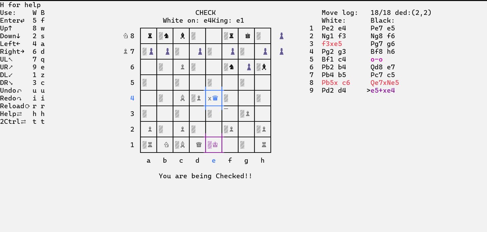

# Cppchess
 A very basic cpp TUI chess game implementation.
 
## Screenshot

 
## Controls
- Use numpad for directions with 5 as enter or select square
<pre>
7 8 9  ↖ ↑ ↗ 
4 5 6  ← ⏎ → 
1 2 3  ↙ ↓ ↘ 
</pre>
- Alternatively for player 2, t for toggle two control mode
<pre>
q w e    ↖ ↑ ↗
a s d f  ← ↓ → ⏎
z   c    ↙   ↘
</pre>
- u and i to undo and redo the moves
- h for help
- r for redraw or reload

## Features
- supports all the basic rules like castling, en-passant etc properly.
- move log implementation with the ability to undo and redo and prune move tree
- two player keyboard support

## To-Do
- [ ] PVE support with different difficulty level
- [ ] save and load games on standard file format
- [ ] local leaderboard
- [ ] Train AI chess-bots with recursive move searches

## Installation
### On Windows
Please use! [Windows Terminal](https://github.com/microsoft/terminal) for proper Text rendering.
Then, You can Download the [Latest Release](https://github.com/Sreinumder/cppchess/releases/latest) and test it.

### On Linux or MacOs
Not supported yet :(
